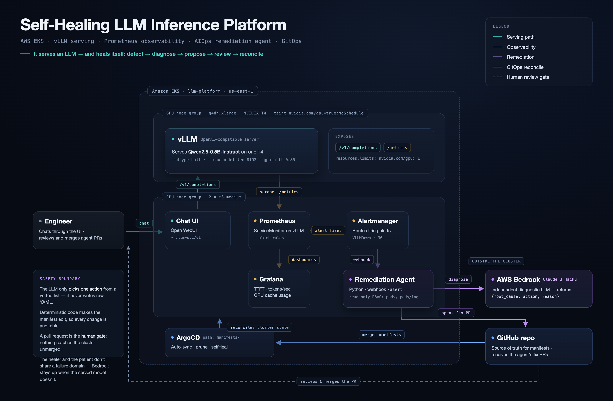
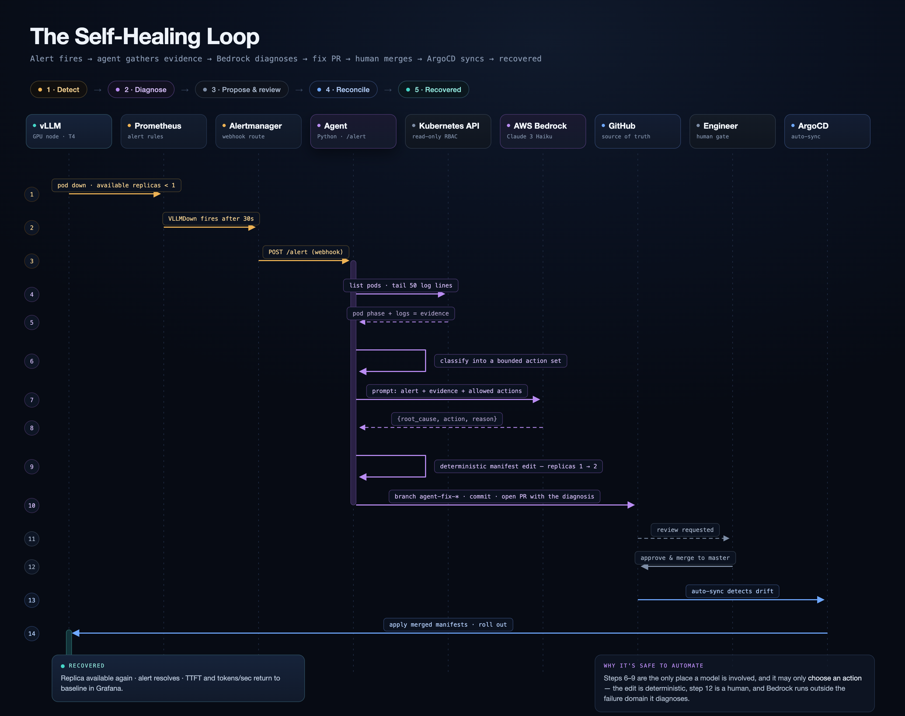

# Self-Healing LLM Inference Platform

A production-shaped platform that **serves an LLM efficiently on Kubernetes** and **repairs itself when it breaks** — an AIOps remediation agent watches the platform, diagnoses failures, and opens a fix as a reviewable pull request instead of paging a human.

It demonstrates both directions of the AI-infrastructure relationship:

- **Infrastructure *for* AI** — efficient GPU model serving with vLLM on EKS.
- **AI *for* infrastructure** — an agent that reads live metrics and logs, diagnoses incidents, and proposes fixes via GitOps.

> Built on Amazon EKS with vLLM, Prometheus/Grafana, ArgoCD, and a Python remediation agent backed by AWS Bedrock. Everything is defined as code (Terraform + Helm + Kubernetes manifests) and reproducible with a single `terraform apply`.

---

## Architecture



The platform runs on an Amazon EKS cluster split across two node groups:

- A **GPU node group** (`g4dn.xlarge`, NVIDIA T4) runs **vLLM**, serving an open-weight model through an OpenAI-compatible API. The node is tainted so only GPU workloads land on it.
- A **CPU node group** (`t3.medium`) runs everything else: the observability stack, the chat UI, the remediation agent, and ArgoCD.

**Git is the source of truth.** ArgoCD continuously reconciles the cluster to match the `manifests/` directory. When the agent opens a fix PR and it's merged, ArgoCD applies the change automatically — this is what makes the platform "self-healing" at the delivery layer.

---

## The Self-Healing Loop



1. **Prometheus** detects a symptom (high latency, a pod down, GPU memory pressure) via alert rules.
2. **Alertmanager** routes the firing alert to the agent as a webhook.
3. The **agent** gathers evidence — pod logs and recent metrics — through the Kubernetes API.
4. It **classifies** the failure into a bounded set of known types.
5. It asks **AWS Bedrock** to diagnose the root cause and choose a fix.
6. Bedrock returns a structured `{root_cause, action, reason}`.
7. The agent **opens a GitHub PR** — with the diagnosis in the description — editing the relevant manifest.
8. A human **reviews and merges**.
9. **ArgoCD** syncs the change and the platform recovers.

### The safety boundary (why this is trustworthy)

The design deliberately constrains what the AI is allowed to do:

- The **LLM only *chooses an action*** from a vetted list (e.g. `scale_up_replicas`, `increase_memory_limit`, `rollback_deployment`). It never writes arbitrary infrastructure YAML.
- **Deterministic code** performs the actual manifest edit, so every change is auditable and bounded.
- **A pull request is the human gate** — nothing reaches the cluster until a person merges it.
- The **diagnostic model (Bedrock) is independent of the served model.** If the served model crashes, the agent that diagnoses it is still up — the healer and the patient don't share a failure domain.

---

## Tech stack

| Layer | Technology | Why |
|---|---|---|
| Cloud | AWS (EKS + EC2 g4dn) | Managed Kubernetes on GPU-backed nodes |
| Infrastructure as code | Terraform (`terraform-aws-modules`) | Reproducible VPC + EKS + node groups |
| Model serving | vLLM (OpenAI-compatible) | PagedAttention + continuous batching for GPU efficiency |
| GitOps delivery | ArgoCD | Git as source of truth, auto-sync, self-heal |
| Packaging | Helm | Templated, PR-editable configuration |
| Metrics | Prometheus | Scrapes vLLM + cluster metrics |
| Dashboards | Grafana | TTFT, tokens/sec, GPU cache usage |
| Alerting | Alertmanager | Fires the webhook that triggers the agent |
| Remediation agent | Python + AWS Bedrock | Diagnoses incidents, opens fix PRs |
| Chat interface | Open WebUI | Verifies serving via a chat frontend |
| Load testing | k6 | Concurrent-load benchmarking |

---

## Repository layout

```
.
├── terraform/                # VPC + EKS + CPU/GPU node groups
│   ├── versions.tf
│   ├── variables.tf
│   ├── vpc.tf
│   ├── eks.tf
│   ├── gpu.tf
│   └── outputs.tf
├── manifests/                # synced onto the cluster by ArgoCD
│   ├── vllm.yaml             # vLLM serving Deployment + Service
│   ├── vllm-servicemonitor.yaml
│   ├── vllm-ui.yaml          # Open WebUI chat interface
│   ├── alert-rules.yaml      # Prometheus alert rules
│   ├── alertmanager-config.yaml
│   └── agent.yaml            # remediation agent Deployment + RBAC
├── agent/                    # the remediation agent
│   ├── app.py
│   ├── requirements.txt
│   └── Dockerfile
├── argocd-app.yaml           # ArgoCD Application pointing at manifests/
└── docs/                     # architecture diagrams
```

---

## How it's built (phases)

**1 · Cluster** — Terraform provisions a VPC, an EKS control plane, a CPU node group, and a tainted GPU node group. The GPU node uses the `AL2_x86_64_GPU` AMI (NVIDIA drivers preinstalled) with a 100 GB root volume sized for the vLLM image and model cache.

**2 · Serving** — vLLM is deployed to the GPU node, requesting `nvidia.com/gpu: 1`, serving an open-weight model behind an OpenAI-compatible API. The NVIDIA device plugin advertises the GPU to Kubernetes as a schedulable resource.

**3 · Observability** — the `kube-prometheus-stack` is installed via Helm. A `ServiceMonitor` points Prometheus at vLLM's `/metrics` endpoint, surfacing inference-specific signals (time-to-first-token, throughput, GPU cache usage) alongside cluster metrics.

**4 · Remediation** — the agent runs as a pod with a least-privilege `ServiceAccount` (read-only on pods and pod logs). Alertmanager routes firing alerts to it; it gathers context, classifies the failure, diagnoses via Bedrock, and opens a GitHub PR. A merged PR is reconciled onto the cluster by ArgoCD.

---

## Running it

> Requires an AWS account with an approved GPU vCPU quota (`Running On-Demand G and VT instances`) in your region, plus the AWS CLI, `terraform`, `kubectl`, and `helm`.

```bash
# 1. provision the cluster
cd terraform
terraform init
terraform apply

# 2. point kubectl at the new cluster
aws eks update-kubeconfig --region us-east-1 --name llm-platform

# 3. install ArgoCD and the monitoring stack
kubectl create namespace argocd
kubectl apply -n argocd -f https://raw.githubusercontent.com/argoproj/argo-cd/stable/manifests/install.yaml

helm repo add prometheus-community https://prometheus-community.github.io/helm-charts
helm repo update
kubectl create namespace monitoring
helm install monitoring prometheus-community/kube-prometheus-stack -n monitoring \
  --set alertmanager.alertmanagerSpec.alertmanagerConfigSelector.matchLabels.release=monitoring

# 4. let ArgoCD deploy the platform from Git
kubectl apply -f argocd-app.yaml
```

**Cost note:** the GPU node runs at an hourly rate — `terraform destroy` tears the whole cluster down cleanly when you're done, and `terraform apply` rebuilds it. Nothing is stateful outside Git.

---

## Engineering notes

A few decisions worth calling out, and problems solved along the way:

- **T4 compatibility** — the Tesla T4 (compute capability 7.5) doesn't support `bfloat16`; vLLM is run with `--dtype half` (float16).
- **Node disk sizing** — the vLLM image plus model cache overflow the default node disk; the GPU node group sets a 100 GB `gp3` root volume via `block_device_mappings`.
- **GPU node isolation** — the GPU node is tainted (`nvidia.com/gpu=true:NoSchedule`) with a matching toleration + `nodeSelector` on vLLM, so the expensive node is reserved for GPU workloads only.
- **Independent diagnosis** — the remediation brain is a separate managed service (Bedrock), not the served model, so it survives the very failures it exists to diagnose.
- **Bounded autonomy** — the agent classifies into a fixed action set and every fix is a reviewable PR; the LLM never writes raw infrastructure changes.

---

## Roadmap

- k6 load-testing profiles with published throughput / latency benchmarks
- Grafana dashboards for TTFT, tokens/sec, and GPU utilization under load
- Traffic-driven autoscaling (scale replicas on sustained load, not just pod-down)
- RAG over past incidents so diagnoses reference prior resolutions
- Kueue-based GPU queue scheduling for multi-tenant fair-share

---

*Built as a hands-on study of running LLM workloads in production: GPU serving efficiency, observability, GitOps delivery, and AI-assisted incident response — on real infrastructure, defined entirely as code.*